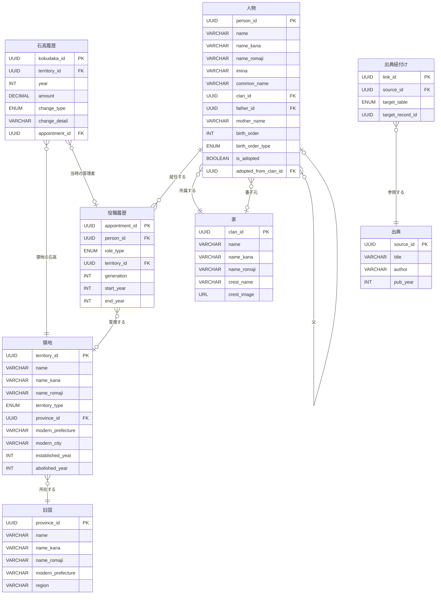

# 藩鑑（はんかん / Hankan）- 要件定義

**バージョン:** 1.0 | **ステータス:** ドラフト | **更新日:** 2026/03/15

---

## 1. プロジェクト概要

### 1.1 背景・目的

江戸時代（1603年〜1868年）における藩制度は、日本史の中でも特に複雑かつ重要な統治機構である。約300の藩が存在し、その藩主は代替わりを繰り返し、石高も時代とともに変動した。しかし、これらの情報を横断的・時系列的に確認できるデジタルツールは現状不足している。

本プロジェクトでは、藩・藩主・石高・将軍・地名を統合的に管理・可視化するアプリ「藩鑑（はんかん / Hankan）」を開発する。

### 1.2 スコープ

- **対象時代:** 江戸時代（1603年〜1868年）を主対象。必要に応じて前後の時代も含む
- **領地データ:** 領地名（漢字・カナ・ローマ字）、領地種別（藩/天領/旗本領）、所在地（旧国名・現代地名）、石高推移、成立・廃止年
- **人物データ:** 藩主・将軍・代官・奉行を統合管理（漢字・カナ・ローマ字）、父母情報、出生順、養子関係
- **役職履歴:** 藩主・将軍・代官・奉行としての在任期間。一人が複数役職を持つケースにも対応（例: 紀州藩主→将軍）
- **家データ:** 家名（漢字・カナ・ローマ字）、家紋。領地との紐付けは役職履歴経由で導出
- **旧国データ:** 68カ国のマスタ（五畿七道の地域区分付き）
- **出典管理:** 各データの根拠となる史料・文献を記録

### 1.3 ターゲットユーザー

- 歴史研究者・学生（日本史専攻）
- 教育機関（高校・大学の歴史教育）
- 歴史愛好家・一般ユーザー
- 学会・郷土史研究団体

---

## 2. 機能要件

### 2.1 機能一覧

| ID    | カテゴリ | 機能名             | 説明                                                                                     | 優先度 |
| ----- | -------- | ------------------ | ---------------------------------------------------------------------------------------- | ------ |
| F-001 | 領地     | 領地検索           | 領地名・地域・旧国名・石高範囲・領地種別（藩/天領/旗本領）・カナ・ローマ字等で領地を検索 | P1     |
| F-002 | 領地     | 領地詳細表示       | 領地名・種別・所在地・現代地名・石高・歴代藩主/代官一覧を表示                            | P1     |
| F-003 | 領地     | 領地石高推移グラフ | 領地単位の石高の時系列変化をグラフで可視化                                               | P1     |
| F-004 | 人物     | 人物詳細表示       | 人物名・役職履歴（藩主/将軍）・父母・出生順・在任中の石高を表示                          | P2     |
| F-005 | 人物     | 血統トラッキング   | 親子関係を可視化（養子関係も区別）                                                       | P2     |
| F-006 | 家       | 家石高推移         | 家（氏族）単位での石高推移を確認可能                                                     | P3     |
| F-007 | 年代     | 年指定検索         | 特定の年を指定し各領地の藩主/代官・石高・将軍を一覧表示                                  | P2     |
| F-008 | 人物     | 将軍情報表示       | 役職履歴から将軍をフィルタ。一覧・在任期間・詳細を表示                                   | P2     |
| F-009 | 地理     | 現代地名マッピング | 各領地の所在地を現代の都道府県・市区町村にマッピング                                     | P3     |
| F-010 | 地理     | 地図表示           | 領地の位置を地図上にプロットし、石高に応じた可視化。天領も含む                           | 希望   |
| F-011 | 比較     | 領地比較機能       | 複数領地の石高推移を重ねて比較                                                           | 希望   |
| F-012 | 比較     | 家比較機能         | 複数の家の石高推移を比較                                                                 | 希望   |

> 優先度: P1 = Phase 1で実装、P2 = Phase 2で実装、P3 = Phase 3で実装、希望 = 余力があれば

### 2.2 各機能の詳細

#### F-001 領地検索

**検索条件:**

- 領地名（部分一致・前方一致）: 例「加賀」「大坂」等
- 領地名カナ検索: 例「カガ」
- 領地名ローマ字検索: 例「Kaga」
- 領地種別フィルタ: 藩 / 天領 / 旗本領
- 旧国名（マスタから選択。例: 武蔵、摂津、陸奥）
- 地域区分（五畿七道。例: 東海道、畿内）
- 現代地名（県名・市名）
- 石高範囲（例: 10万石以上）
- 担当者名（藩主/代官名から領地を逆引き）

#### F-002 領地詳細表示

**表示項目:**

- 領地名（漢字・カナ・ローマ字）、領地種別
- 所在地（旧国名、旧国マスタから取得）
- 現代の県・市名
- 歴代藩主/代官一覧（在任期間付き、役職履歴から導出）
- 歴代の治藩家一覧（役職履歴→人物→家の連鎖で導出。藩の場合）
- 石高推移グラフ（F-003と連動）
- データ出典の表示（出典テーブルから取得）

#### F-003 領地石高推移グラフ

- 領地ごとの石高変動を折れ線グラフで表示
- ポイントタップで藩主名・石高をツールチップ表示
- 改易・加増・減封のイベントをアノテーション表示

#### F-004 人物詳細表示

**表示項目:**

- 人物名（漢字・カナ・ローマ字、諱・通称含む）
- 役職履歴一覧（藩主/将軍、在任期間）— 例: 「紀州藩 第5代藩主 (1705-1716) → 征夷大将軍 第8代 (1716-1745)」
- 父親名・母親名（判明分）
- 「○○の第N男」「○○の第N女」という出生順情報
- 在任中の石高・石高変動イベント
- 前任・後任へのリンク

#### F-005 血統トラッキング

- 親子関係をツリー形式で表示
- 養子関係を実子と区別して可視化（線のスタイルで区別）
- 養子元（実家）へのリンク

#### F-006 家石高推移

- 家（氏族）単位での石高推移を確認
- 導出方法: 役職履歴（藩主）→ 人物 → 家 の連鎖で、各時点でその家が治めていた藩の石高を合算
- 例: 徳川家が複数藩を保有していた場合の総石高推移
- 前田家・伊達家・島津家など、複数藩を持つ家の総石高推移を可視化

#### F-007 年指定検索

- 指定年のスナップショットを表示:
  - その年の征夷大将軍名
  - 各領地の藩主/代官名と石高
  - 石高ランキング（ソート可能。領地種別フィルタ付き）
- スライダーまたはタイムラインUIで年を選択

#### F-008 将軍情報表示

- 役職履歴から「役職種別=将軍」でフィルタし、徳川将軍15代の一覧と在任期間を表示
- 年指定検索（F-007）と連動し、指定年の将軍をハイライト
- 将軍詳細 = 人物詳細（F-004）へのリンク。その時代の主な領地へのリンクも提供

#### F-009 現代地名マッピング

- 各領地の所在地を現代の都道府県・市区町村にマッピング
- 例: 加賀藩 → 石川県金沢市、大坂（天領）→ 大阪府大阪市
- 複数市町村にまたがる場合は主たる地名＋補足
- F-010（地図表示）と連携し、地図上へのプロットにも活用

#### F-010 地図表示（希望）

- 領地の位置を地図上にプロット（藩・天領を色分け）
- 石高に応じた円のサイズで可視化
- F-009の現代地名データを利用

#### F-011 / F-012 比較機能（希望）

- 複数領地または複数家の石高推移を重ねて比較グラフ表示

---

## 3. データモデル

### 3.1 主要エンティティ

| エンティティ                  | 主要属性                                                                                                                                 | 説明                                             |
| ----------------------------- | ---------------------------------------------------------------------------------------------------------------------------------------- | ------------------------------------------------ |
| 人物 (Person)                 | person_id, 名前, 名前カナ, 名前ローマ字, 諱, 通称, 家\_id(FK), 父\_id(FK), 母名, 出生順, 出生順種別(男/女), 養子フラグ, 養子元家\_id(FK) | 藩主・将軍・代官・奉行を含むすべての人物         |
| 役職履歴 (Appointment)        | appointment_id, person_id(FK), 役職種別, territory_id(FK, nullable), 代数, 就任年, 退任年                                                | 人物が就いた役職の履歴。一人が複数の役職を持てる |
| 領地 (Territory)              | territory_id, 領地名, 領地名カナ, 領地名ローマ字, 領地種別, 旧国\_id(FK), 現代県名, 現代市名, 所在地, 成立年, 廃止年                     | 藩・天領・旗本領などすべての領地を統合管理       |
| 家 (Clan)                     | clan_id, 家名, 家名カナ, 家名ローマ字, 家紋名, 家紋画像                                                                                  | 氏族の基本情報                                   |
| 旧国 (Province)               | province_id, 旧国名, 旧国名カナ, 旧国名ローマ字, 現代県名(主), 地域区分                                                                  | 旧国名のマスタ。全68カ国の固定セット             |
| 石高履歴 (Kokudaka)           | kokudaka_id, territory_id(FK), 年, 石高(万石), 変動種別, 変動理由詳細, appointment_id(FK)                                                | 領地単位の石高変動履歴                           |
| 出典 (Source)                 | source_id, 出典名, 著者, 出版年, URL, 備考                                                                                               | データの根拠となる史料・文献                     |
| データ出典紐付け (SourceLink) | link_id, source_id(FK), 対象テーブル, 対象レコードID, ページ番号, 備考                                                                   | 各データレコードと出典の多対多の紐付け           |

> **設計変更 (v1.1):** 旧「藩 (Han)」テーブルを「領地 (Territory)」に一般化。天領・旗本領も同一テーブルで管理し、領地種別で区別する。旧 `han_id` は `territory_id` に変更。

### 3.2 エンティティ関係

- **人物 1:N 役職履歴** — 一人が複数の役職を持てる（例: 紀州藩主 → 将軍）
- **役職履歴 N:1 領地** — 藩主・代官の場合、どの領地を管理するかを参照（将軍の場合はnull）
- **人物 → 人物** — 自己参照: 父親関係
- **人物 → 家** — 所属する家。養子の場合、養子元家\_idで実家も参照
- **家 ←(導出)→ 領地** — 直接のFKは持たない。「領地 ← 役職履歴 → 人物 → 家」の連鎖で導出
- **領地 N:1 旧国** — 領地は一つの旧国に所在（マスタ参照）
- **領地 1:N 石高履歴** — 一つの領地に複数の石高レコード
- **出典 ←→ 各データ** — SourceLinkを介して任意のデータレコードに出典を紐付け

### 3.3 ER図



### 3.4 具体例: 徳川吉宗のデータ構造

紀州藩主から将軍になった徳川吉宗を例に、各テーブルのデータがどう入るかを示す。

#### 家 (Clan)

```
clan_id: "clan-tokugawa"
家名: "徳川"
家名カナ: "トクガワ"
家名ローマ字: "Tokugawa"
家紋名: "三つ葉葵"
```

#### 人物 (Person)

```
person_id: "person-yoshimune"
名前: "徳川吉宗"
名前カナ: "トクガワヨシムネ"
名前ローマ字: "Tokugawa Yoshimune"
諱: "吉宗"
通称: "源六"
家_id: "clan-tokugawa"
父_id: "person-mitsusada"  ← 徳川光貞（紀州藩第2代藩主）
母名: "浄円院"
出生順: 4
出生順種別: "男"
養子フラグ: false
養子元家_id: null
```

#### 役職履歴 (Appointment) — 1人に2レコード

```
-- ① 紀州藩主として
appointment_id: "apt-yoshimune-kii"
person_id: "person-yoshimune"
役職種別: "藩主"
territory_id: "terr-kishu"  ← 紀州藩
代数: 5
就任年: 1705
退任年: 1716

-- ② 将軍として
appointment_id: "apt-yoshimune-shogun"
person_id: "person-yoshimune"  ← 同じ人物！
役職種別: "将軍"
territory_id: null  ← 将軍なので領地はnull
代数: 8
就任年: 1716
退任年: 1745
```

#### 領地 (Territory) — 藩と天領が同じテーブル

```
-- 藩の例: 紀州藩
territory_id: "terr-kishu"
領地名: "紀州藩"
領地名カナ: "キシュウハン"
領地名ローマ字: "Kishū-han"
領地種別: "藩"
旧国_id: "prov-kii"
現代県名: "和歌山県"
現代市名: "和歌山市"
成立年: 1619
廃止年: 1871

-- 天領の例: 大坂
territory_id: "terr-osaka-tenryo"
領地名: "大坂"
領地名カナ: "オオサカ"
領地名ローマ字: "Ōsaka"
領地種別: "天領"
旧国_id: "prov-settsu"
現代県名: "大阪府"
現代市名: "大阪市"
成立年: 1615
廃止年: 1868

-- 天領の例: 佐渡金山
territory_id: "terr-sado-tenryo"
領地名: "佐渡"
領地名カナ: "サド"
領地名ローマ字: "Sado"
領地種別: "天領"
旧国_id: "prov-sado"
現代県名: "新潟県"
現代市名: "佐渡市"
成立年: 1601
廃止年: 1868
```

#### 旧国 (Province)

```
province_id: "prov-kii"
旧国名: "紀伊"
旧国名カナ: "キイ"
旧国名ローマ字: "Kii"
現代県名: "和歌山県"
地域区分: "南海道"
```

#### 石高履歴 (Kokudaka)

```
-- 紀州藩の石高
kokudaka_id: "koku-kishu-1705"
territory_id: "terr-kishu"
年: 1705
石高: 55.5  ← 55万5000石
変動種別: null
appointment_id: "apt-yoshimune-kii"

-- 天領: 大坂の石高
kokudaka_id: "koku-osaka-1700"
territory_id: "terr-osaka-tenryo"
年: 1700
石高: 41.0
変動種別: null
appointment_id: "apt-osaka-bugyo-1700"  ← 大坂町奉行
```

#### 出典 (Source) + 紐付け

```
-- 出典
source_id: "src-hanshi"
出典名: "藩史大事典"
著者: "木村礎二監修"
出版年: 1989

-- 紐付け
link_id: "link-001"
source_id: "src-hanshi"
対象テーブル: "人物"
対象レコードID: "person-yoshimune"
ページ番号: "p.342-345"
```

### 3.5 クエリ例

#### 「1710年に紀州藩を治めていた家は？」

```sql
SELECT c.家名
FROM Appointment a
JOIN Person p ON a.person_id = p.person_id
JOIN Clan c ON p.clan_id = c.clan_id
WHERE a.territory_id = 'terr-kishu'
  AND a.role_type = '藩主'
  AND a.start_year <= 1710
  AND (a.end_year >= 1710 OR a.end_year IS NULL)
-- 結果: 徳川
```

#### 「徳川吉宗の全役職を時系列で」

```sql
SELECT a.role_type, t.領地名, a.generation, a.start_year, a.end_year
FROM Appointment a
LEFT JOIN Territory t ON a.territory_id = t.territory_id
WHERE a.person_id = 'person-yoshimune'
ORDER BY a.start_year
-- 結果:
-- 藩主 | 紀州藩 | 5代 | 1705 | 1716
-- 将軍 | NULL   | 8代 | 1716 | 1745
```

#### 「1700年時点の石高ランキング（天領含む）」

```sql
SELECT t.領地名, t.領地種別, k.石高
FROM Kokudaka k
JOIN Territory t ON k.territory_id = t.territory_id
WHERE k.年 = (SELECT MAX(年) FROM Kokudaka k2 WHERE k2.territory_id = k.territory_id AND k2.年 <= 1700)
ORDER BY k.石高 DESC
-- 結果: 天領を含む全領地の石高ランキングが取得できる
```

### 3.6 属性詳細

#### 人物 (Person)

| 属性名       | 型       | 必須 | 説明                                   |
| ------------ | -------- | ---- | -------------------------------------- |
| person_id    | UUID     | ○    | 主キー                                 |
| 名前         | VARCHAR  | ○    | 人物名（例: 徳川吉宗）                 |
| 名前カナ     | VARCHAR  | ○    | 読み仮名（例: トクガワヨシムネ）       |
| 名前ローマ字 | VARCHAR  | ○    | ローマ字表記（例: Tokugawa Yoshimune） |
| 諱           | VARCHAR  | —    | いみな                                 |
| 通称         | VARCHAR  | —    | 通称名                                 |
| 家\_id       | UUID(FK) | ○    | 所属する家                             |
| 父\_id       | UUID(FK) | —    | 父親のperson_id（自己参照）            |
| 母名         | VARCHAR  | —    | 母親名（判明分）                       |
| 出生順       | INT      | —    | 何番目の子か                           |
| 出生順種別   | ENUM     | —    | 男/女                                  |
| 養子フラグ   | BOOLEAN  | ○    | 養子かどうか                           |
| 養子元家\_id | UUID(FK) | —    | 養子の場合の実家（元の家）             |

#### 役職履歴 (Appointment)

| 属性名         | 型       | 必須 | 説明                                   |
| -------------- | -------- | ---- | -------------------------------------- |
| appointment_id | UUID     | ○    | 主キー                                 |
| person_id      | UUID(FK) | ○    | 人物への外部キー                       |
| 役職種別       | ENUM     | ○    | 藩主 / 将軍 / 代官 / 奉行（拡張可能）  |
| territory_id   | UUID(FK) | —    | 領地への外部キー（将軍の場合はnull）   |
| 代数           | INT      | —    | 第何代か（代数の概念がない役職もある） |
| 就任年         | INT      | ○    | 就任年                                 |
| 退任年         | INT      | —    | 退任年                                 |

> 役職種別の値: 藩主, 将軍, 代官, 町奉行, 遠国奉行, 勘定奉行（将来拡張可能）

#### 領地 (Territory)

| 属性名         | 型       | 必須 | 説明                                 |
| -------------- | -------- | ---- | ------------------------------------ |
| territory_id   | UUID     | ○    | 主キー                               |
| 領地名         | VARCHAR  | ○    | 領地の名称（例: 加賀藩, 大坂, 佐渡） |
| 領地名カナ     | VARCHAR  | ○    | 読み仮名                             |
| 領地名ローマ字 | VARCHAR  | ○    | ローマ字表記                         |
| 領地種別       | ENUM     | ○    | 藩 / 天領 / 旗本領 / その他          |
| 旧国\_id       | UUID(FK) | ○    | 旧国マスタへの外部キー               |
| 現代県名       | VARCHAR  | ○    | 現代の都道府県名                     |
| 現代市名       | VARCHAR  | —    | 現代の市区町村名                     |
| 所在地         | VARCHAR  | —    | 城下町・陣屋所在地名                 |
| 成立年         | INT      | ○    | 成立年                               |
| 廃止年         | INT      | —    | 廃止年                               |

> **設計変更:** 旧「藩 (Han)」を一般化。`領地種別` で藩・天領・旗本領を区別。天領は代官・奉行が管理し、藩は藩主が管理する。

#### 家 (Clan)

| 属性名       | 型      | 必須 | 説明                         |
| ------------ | ------- | ---- | ---------------------------- |
| clan_id      | UUID    | ○    | 主キー                       |
| 家名         | VARCHAR | ○    | 家の名称（例: 徳川）         |
| 家名カナ     | VARCHAR | ○    | 読み仮名（例: トクガワ）     |
| 家名ローマ字 | VARCHAR | ○    | ローマ字表記（例: Tokugawa） |
| 家紋名       | VARCHAR | —    | 家紋の名称                   |
| 家紋画像     | URL     | —    | 家紋画像のURL                |

#### 旧国 (Province)

| 属性名         | 型      | 必須 | 説明                       |
| -------------- | ------- | ---- | -------------------------- |
| province_id    | UUID    | ○    | 主キー                     |
| 旧国名         | VARCHAR | ○    | 旧国名（例: 摂津）         |
| 旧国名カナ     | VARCHAR | ○    | 読み仮名（例: セッツ）     |
| 旧国名ローマ字 | VARCHAR | ○    | ローマ字表記（例: Settsu） |
| 現代県名       | VARCHAR | ○    | 主たる現代の都道府県名     |
| 地域区分       | VARCHAR | ○    | 五畿七道の区分             |

#### 石高履歴 (Kokudaka)

| 属性名         | 型       | 必須 | 説明                                             |
| -------------- | -------- | ---- | ------------------------------------------------ |
| kokudaka_id    | UUID     | ○    | 主キー                                           |
| territory_id   | UUID(FK) | ○    | 領地への外部キー                                 |
| 年             | INT      | ○    | 記録年                                           |
| 石高           | DECIMAL  | ○    | 石高（万石単位）                                 |
| 変動種別       | ENUM     | —    | 加増 / 減封 / 改易 / 新封 / 分知 / 復封 / その他 |
| 変動理由詳細   | VARCHAR  | —    | 自由記述の補足説明                               |
| appointment_id | UUID(FK) | —    | 当時の管理者（藩主 or 代官等）の役職履歴         |

#### 出典 (Source)

| 属性名    | 型      | 必須 | 説明                    |
| --------- | ------- | ---- | ----------------------- |
| source_id | UUID    | ○    | 主キー                  |
| 出典名    | VARCHAR | ○    | 史料・文献名            |
| 著者      | VARCHAR | —    | 著者名                  |
| 出版年    | INT     | —    | 出版年                  |
| URL       | VARCHAR | —    | オンラインリソースのURL |
| 備考      | TEXT    | —    | 補足情報                |

#### データ出典紐付け (SourceLink)

| 属性名         | 型       | 必須 | 説明                                   |
| -------------- | -------- | ---- | -------------------------------------- |
| link_id        | UUID     | ○    | 主キー                                 |
| source_id      | UUID(FK) | ○    | 出典への外部キー                       |
| 対象テーブル   | ENUM     | ○    | 人物 / 領地 / 石高履歴 / 役職履歴 / 家 |
| 対象レコードID | UUID     | ○    | 対象レコードの主キー                   |
| ページ番号     | VARCHAR  | —    | 出典中の該当ページ                     |
| 備考           | VARCHAR  | —    | 異説がある場合の注記等                 |

### 3.7 設計上の注意

- **領地テーブルで藩・天領・旗本領を統合管理。** 年指定検索で全国の石高分布（天領含む）を一覧できる
- **人物と役職の分離** により、藩主→将軍の異動だけでなく、代官→別の天領の代官、といった異動も表現可能
- **藩と家は直接紐付けない。** 役職履歴→人物→家の連鎖から導出
- **旧国名はマスタテーブルで管理。** 表記ゆれ防止
- **石高の変動種別はENUM。** フィルタ・集計に活用
- **出典管理により信頼性を担保**
- **役職種別・領地種別は将来拡張可能なENUM**

---

## 4. 画面設計・UI/UX

### 4.1 主要画面一覧

| #    | 画面名         | 概要                                               | 対応機能            | Phase |
| ---- | -------------- | -------------------------------------------------- | ------------------- | ----- |
| S-01 | トップページ   | 検索バー、年代スライダー、主要藩ハイライト         | F-001, F-007        | 1     |
| S-02 | 領地一覧画面   | 検索結果のリスト表示。領地種別フィルタ・ソート付き | F-001               | 1     |
| S-03 | 領地詳細画面   | 石高推移グラフ、歴代藩主/代官リスト、現代地名      | F-002, F-003, F-009 | 1     |
| S-04 | 人物詳細画面   | 個人情報、役職履歴、血統ツリー、在任中の石高       | F-004, F-005        | 2     |
| S-05 | 家詳細画面     | 保有領地一覧、家石高推移グラフ                     | F-006               | 3     |
| S-06 | 年代ビュー画面 | 指定年のスナップショット。将軍情報、全領地一覧     | F-007, F-008        | 2     |
| S-07 | 将軍一覧画面   | 徳川将軍15代の一覧と詳細                           | F-008               | 2     |
| S-08 | 比較画面       | 複数領地/家の石高推移を重ねて比較                  | F-011, F-012        | 3     |

### 4.2 UI/UX 設計方針

#### ビジュアルデザイン

- 和風デザインを基調とし、落ち着いた配色を採用
- メインカラー: 紺（#1B2A4A）・白・金（#C9A96E）・墨（#333）
- 書体: 見出しに明朝体系、本文にゴシック体系

#### レスポンシブ対応

- PC・タブレット・スマートフォン対応
- ブレークポイント: 768px / 1024px

#### インタラクション

- グラフ: ホバーで詳細情報をツールチップ表示
- 年代スライダー: ドラッグまたはクリックで操作可能
- 血統ツリー: ズーム・パンが可能なインタラクティブ図
- 地図: クリッカブルなマーカーで藩詳細へ遷移

### 4.3 画面遷移図

```
トップページ (S-01)
├─ 検索 → 領地一覧 (S-02) → 領地詳細 (S-03)
│                                  ├─ 人物詳細 (S-04) ← 藩主も将軍も代官も同じ画面
│                                  └─ 家詳細 (S-05)
├─ 年代スライダー → 年代ビュー (S-06)
│                              └─ 将軍一覧 (S-07) → 人物詳細 (S-04)
└─ 比較 → 比較画面 (S-08)
```

---

## 5. 技術・開発計画

### 5.1 技術スタック

| レイヤー       | 技術                                | 備考                                                                      |
| -------------- | ----------------------------------- | ------------------------------------------------------------------------- |
| フロントエンド | Next.js + TypeScript                | App Router。SSG/ISR活用でパフォーマンス確保                               |
| グラフ描画     | Recharts or D3.js                   | 石高推移グラフ、比較グラフ                                                |
| 血統ツリー     | D3.js or React Flow                 | ズーム・パン対応                                                          |
| 地図           | Leaflet / Mapbox                    | F-010用（希望機能）                                                       |
| API            | Next.js API Routes (Route Handlers) | フロントと同一リポジトリで完結。REST形式                                  |
| ORM            | Prisma                              | 型安全なクエリ。複雑な集計は$queryRawで生SQLを併用                        |
| データベース   | Neon (PostgreSQL)                   | サーバーレスPostgreSQL。アイドル時自動スケールダウン。検索はpg_trgmで対応 |
| ホスティング   | Vercel                              | Next.jsとの親和性が高い。Neonとの統合も容易                               |

### 5.2 データ収集・整備方針

歴史データの収集は本プロジェクトの最大の課題の一つ。

- 既存オープンデータ（Wikipedia、国立国会図書館デジタルコレクション等）の活用
- 歴史学者・研究者との連携によるデータ監修
- コミュニティベースのデータ寄稿・修正の仕組み（将来的）

**データ量見積もり:**

- 領地: 約350件（藩 約300件 + 天領 約30件 + 旗本領 約20件）
- 人物: 約3,100件（藩主 約3,000件 + 代官・奉行 約100件）
- 家: 約200件
- 石高履歴: 約7,000件（天領分を追加）
- 将軍: 15件
- 出典: 約50件

### 5.3 開発フェーズ

#### Phase 1（1〜2ヶ月）

**ゴール:** 基本的な藩検索・閲覧ができる状態

- データモデル設計・DB構築
- 主要領地50件（藩 + 主要天領）のデータ整備
- F-001 領地検索
- F-002 領地詳細表示
- F-003 領地石高推移グラフ
- S-01, S-02, S-03 画面実装

#### Phase 2（2〜3ヶ月）

**ゴール:** 藩主・将軍・年代検索の完成

- F-004 人物詳細表示
- F-005 血統トラッキング
- F-007 年指定検索
- F-008 将軍情報表示
- S-04, S-06, S-07 画面実装

#### Phase 3（1〜2ヶ月）

**ゴール:** 家機能・地理機能・全藩データ

- F-006 家石高推移
- F-009 現代地名マッピング
- F-010 地図表示（希望）
- F-011/F-012 比較機能（希望）
- S-05, S-08 画面実装
- データ拡充（全領地：藩 + 天領 + 旗本領）

#### Phase 4（継続）

- UI改善・パフォーマンスチューニング
- データ追加・修正
- コミュニティ機能
- SEO/OGP対応
- 多言語対応（ローマ字データを活用）

### 5.4 非機能要件

| 項目           | 要件                                                                               |
| -------------- | ---------------------------------------------------------------------------------- |
| ページ読み込み | 2秒以内（初回表示）                                                                |
| 検索結果表示   | 1秒以内                                                                            |
| グラフ描画     | 60fps以上のスムーズなアニメーション                                                |
| 初期データ     | 主要領地50件以上の人物・石高データ                                                 |
| データ拡張性   | 後から領地・人物データを追加・修正可能な構造。territory_typeで藩/天領/旗本領を拡張 |
| セキュリティ   | 参照用アプリ。データ編集は管理者のみ                                               |
| バックアップ   | データのバックアップとバージョニング                                               |
| SEO            | 検索エンジン最適化・OGP対応（Phase 4で対応）                                       |

---

## 6. 用語定義

| 用語       | カナ                 | ローマ字       | 定義                                                                    |
| ---------- | -------------------- | -------------- | ----------------------------------------------------------------------- |
| 領地       | りょうち             | Territory      | 藩・天領・旗本領を統合的に扱う上位概念。territory_typeで種別を区分      |
| 藩         | はん                 | Han            | 大名が支配した領域。領地の一種別（territory_type=藩）                   |
| 天領       | てんりょう           | Tenryō         | 幕府直轄地。大坂・長崎・佐渡金山等。領地の一種別（territory_type=天領） |
| 藩主       | はんしゅ             | Hanshu         | 藩を統治する大名。人物の役職種別の一つ                                  |
| 代官       | だいかん             | Daikan         | 天領を管理する幕府役人。人物の役職種別の一つ                            |
| 石高       | こくだか             | Kokudaka       | 藩の経済力指標。米の生産高基準。「万石」単位                            |
| 家         | いえ                 | Ie             | 武家の氏族単位。一つの家が複数藩を持つ場合あり                          |
| 旧国名     | きゅうこくめい       | Kyūkokumei     | 明治以前の地域区分名（例: 武蔵、摂津、陸奥）                            |
| 征夷大将軍 | せいいたいしょうぐん | Seii Taishōgun | 武家政権の最高権力者。徳川将軍15代を管理対象                            |
| 諱         | いみな               | Imina          | 実名。藩主の正式な名前                                                  |

---

## 7. 前提条件・制約

- 歴史データは史料により諸説があるため、可能な限り信頼性の高い出典に基づく
- 石高データは正確な年次データが存在しない場合、最も近い記録年を採用する
- 出生順情報は不明の場合「不明」と表示する
- 現代地名マッピングは主たる城下町を基準。飛び地等の複雑な領域は今後の課題
- 初期リリースは日本語のみ。多言語対応は将来的な拡張（ローマ字データは先行して整備）

---

## 8. ENUM定義

| フィールド           | 有効値                                                                       |
| -------------------- | ---------------------------------------------------------------------------- |
| territory_type       | `藩`, `天領`, `旗本領`                                                       |
| role_type            | `藩主`, `将軍`, `老中`, `若年寄`, `大老`, `代官`, `奉行`, `その他`           |
| birth_order_type     | `男`, `女`                                                                   |
| kokudaka_change_type | `加増`, `減封`, `改易`, `新封`, `分知`, `復封`, `その他`                     |
| region (五畿七道)    | `畿内`, `東海道`, `東山道`, `北陸道`, `山陰道`, `山陽道`, `南海道`, `西海道` |

---

## 改訂履歴

| 日付       | Ver. | 内容     |
| ---------- | ---- | -------- |
| 2026/03/15 | 1.0  | 初版作成 |
